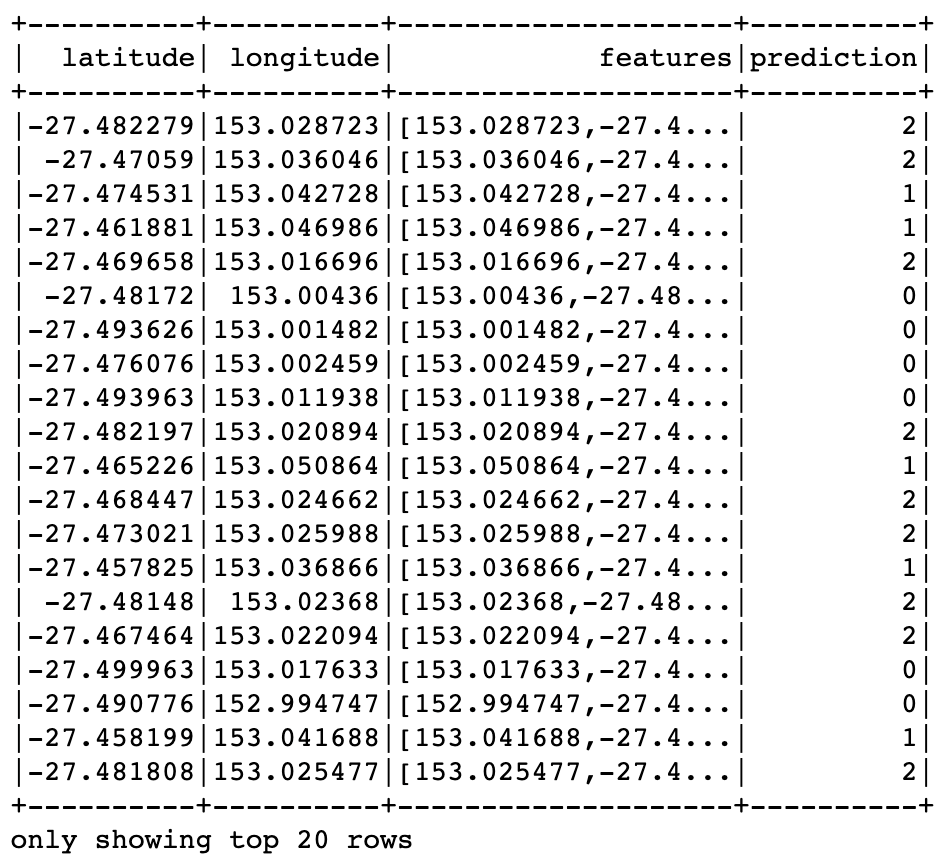
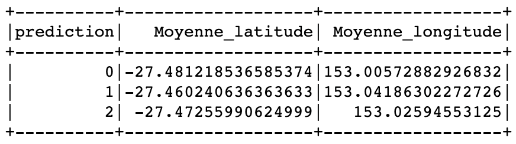
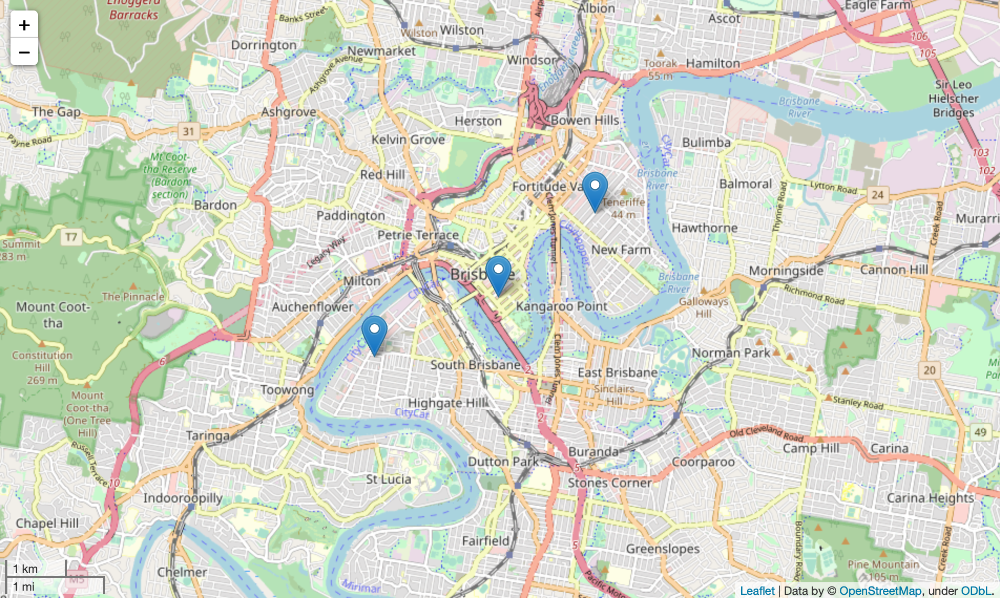

# Kmeans
L'objectif de ce projet est de proposer un k-means clustering de Brisbane City Bike en fonction de l'emplacement des stations vélos en utilisant spark. 

# Exécution du programme à partir d'un terminal
  Ouvrir un terminal et taper les lignes suivantes :
 - git clone  https://github.com/NolanCarre/Kmeans.git
 - cd Kmeans 
 - python Script/Spark_Kmeans.ipynb 
 
 Ou taper : sh main.sh (Moins lisible).
 
# Clustering
## Application de la methode K-means

  
  ## Les 3 cluster obtenus

  
  ## Affichage de la position des clusters à Brisbane

